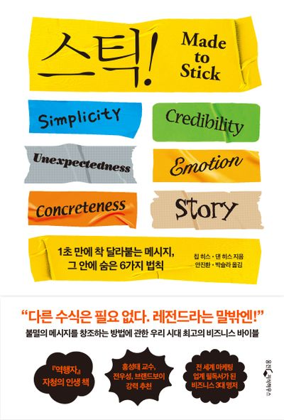

# 스틱

## 어떤 이야기가 기억되는가?

어떤 이야기는 기억에 잘 남지만 어떤 이야기는 기억에 남지 않는다. 잘 기억에 남고 책에서는 사람들의 뇌에 달라붙는 메시지를 스티커 메시지라고 한다.
그 고착성은 어디서 오는가? 다음 여섯가지를 기준으로 삼으면 누구나 스티커 메시지를 만들 수 있다고 한다. (p35)

- **단순성** : (중요한 것만을 남겨야한다.) 가장 이상적인 형태는 속담이다.
- **의외성** : 사람들의 예상을 깨뜨려서 긴장감을 높이고 이목을 집중시켜야한다.
- **구체성**: 구체적이고 상세한이미지를 떠올리게 해야한다. 왜냐하면 우리의 두뇌는 구체적인 정보를 기억하도록 만들어져 있기 때문이다.
- **신뢰성** : 권위있는 집단에서 하는 말이라면 신뢰성이 있다고 볼 수 있다. 하지만 일상생활에서 우리는 그러한 권위를 좋아하지 않는다. 일상생활에서는 우리의 메시지를 스스로 시험해볼 수 있도록 하는 것이 좋다.
- **감성**: 메시지를 상대방이 중요하게 받아들이게 하려면 무언가를 느끼게 만들어야한다.
- **스토리** : 우리가 말한 메시지대로 상대방이 행동하게 하려면 어떻게 해야할까? 스토리를 들려줘야한다. 스토리는 일종의 정신 자극제 역할을 함으로써 뜻하지 않은 상황에 더욱 신속하고 효율적으로 대처하도록 도와준다.

당연한 기준인 것 같은데 우리는 왜 잘 지키지 못할까? p40 바로 지식의 저주 때문이다. 한번 정보를 알게되면 그때부터는 알지 못한다는 느낌을 이해할 수 없게된다. (지식의 저주) 또 이런 저주는 타인에게 전달하기 어렵게 만든다. 해결방법은 메시지를 받아들여 변형시키는 것이다.

- 좋은 메시지의 예 : 존 F. 케네디 대통령

  > 앞으로 10년 안에 인간을 달에 착륙시키고 무사히 지구로 귀환시킨다.
  > 6가지 모두 충족

- 안좋은 예시 : 평범한 CEO의 메시지
  > 우리의 사명은 팀 중심적 혁신과 전략적인 주도권 확립을 통해......
