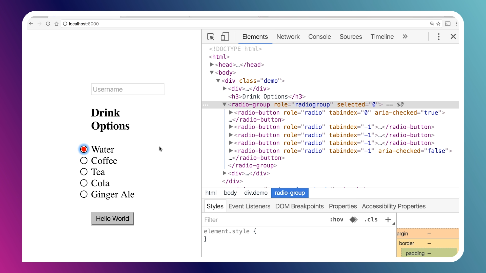

# 접근성 기초
- 브라우저는 접근성 트리를 만든다. 
- 버튼에 접근성 이름이 없으면 자식요소들의 이름을 모은다.
  - 만약 버튼 안에 이미지가 있으면 alt를 가져온다. 
- inert: 접근성 트리에서 제외해버린다. 
- 스낵바 같은 경우에는 role = dialog를 부여하면 된다. 


### TabIndex

- tab ordered button input implicitly focusable
- but 다른 태그들 
- tab order는 태그들의 순서로 인해서 결정되기 때문에 돔들의 순서를 옮겨서 tab order를 적절하게 하자. 
- tabIndex를 통해서 focusable이 가능하지 않은 것들도 focus가 가능하게 할 수 있다. 
  - 기본적으로 `tabIndex=0` 를 설정하면 된다. 
  - `tabIndex=-1` 이라면 `tab focus`를 생략한다.
  - tabIndex가 0보다 크면 그 쪽부터 `focus`가 발생한다. 
  - tabIndex가 0보다 큰 거 언제사용하나? -> 안사용하는게 좋다
  - 먼저 tab focus가 되길 바란다면 dom 순서를 조정하는게 더 낫다. 

### Button
always just use button not customed button!

만약 커스텀 버튼을 만든다고 가정할 때 고려해야할 것들
- tabindex = 0 설정 
- voiceover에서 버튼 이라고 불리기 (button component는 마지막에 무조건 버튼이라고 불림)
- 이벤트핸들러를 부착했을 때 포커스 후 spacebar를 누르면 핸들러 호출을 못함 (버튼은 기본적으로 함 )
  - 추가하려면 keydown handler 등등 여러가지를 만들어줘야함 ㅜㅜ 그냥 버튼 써야됨
- disabled일 때 핸들러가 호출되지 말아야함 
  - 버튼은 그냥 호출되지 않음

### revolving tabindex
옵션에 포커커스되어있을 때 위아래로 움직이면 해당 옵션만 tabindex가 0이되고 나머지는 -1이 되어야함 (커스텀 select 컴포넌트를 만들때임)

[영상확인](https://youtu.be/uCIC2LNt0bk?t=76)



### Label
test Alternatives는 중요하다. 
label은 네임이다. screen reader는 name을 읽는다. 
스크린리더는 name, e

input만 있다고 name이 결정되지 않는다. label 컴포넌트가 있어야한다. 

aria-label 태그는 태그에 name(label)을 등록한다. 태그안의 content보다 우위에 있다. 

`aria-labelled-by-attribute`  여기에 id를 전달하면 아이디들을 merge해서 element의 label 이 된다.  이건 언제 사용??  

### aria-hidden
스크린리더에서 읽지 않는다. 

```html
<a href="#" class="tooltip" aria-disabled="true" role="presentation">
    <span class="offscreen">대한항공</span>
    <span aria-hidden="true">KE</span>
</a>
```
aria-disable를 true와 role='presentation'을 통해서 해서 해당 a태그가 링크가 아님을 말하고 
스크린리더에 읽게해주고 싶은 것만 남긴다. 아니면 aria-hidden으로 숨긴다. 


